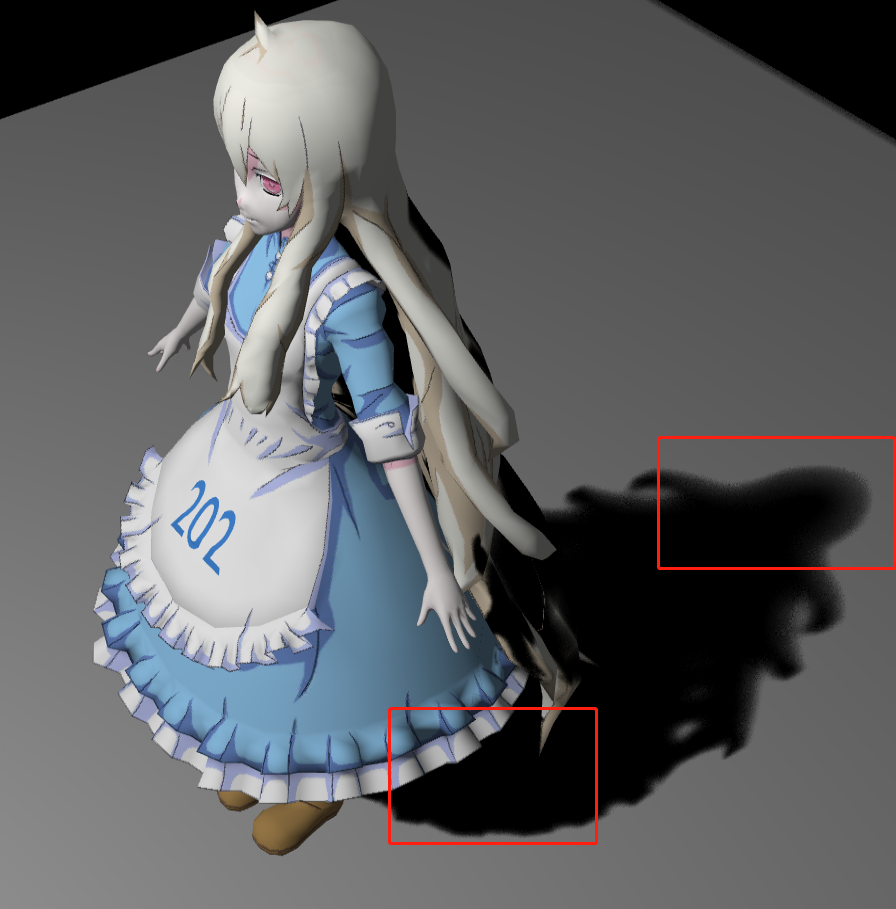

# Soft Shadow

## Set up

**Operating & compiling environment**:

* Visual studio code (Windows 11) & Live server

**Library**:

* WebGL

## Implementation

### Hard Shadow Mapping

**Two pass approaches:** 

The 1st Pass: render a depth map from the light source which is also known as ShadowMap.

The 2nd Pass: render the real scene from the current camera and transform pixel point to the light source space, take its depth in the light source space with the same uv coordinates recorded in ShadowMap for comparison. If the depth is is greater than the depth in ShadowMap, the point is in the shadow.

<div style="display: flex; justify-content: center; gap: 10px;">
  <div>
    
    <div align="center">First pass</div>
  </div>
  <div>
    
    <div align="center">Second pass</div>
  </div>
</div>


```c++
// WebGLRenderer.js
// Shadow pass
// Create a shadow map stored in shadowMeshes[]
if (this.lights[l].entity.hasShadowMap == true) {
    for (let i = 0; i < this.shadowMeshes.length; i++) {
        this.shadowMeshes[i].draw(this.camera);
    }
}

// Camera pass
for (let i = 0; i < this.meshes.length; i++) {
    this.gl.useProgram(this.meshes[i].shader.program.glShaderProgram);
    this.gl.uniform3fv(this.meshes[i].shader.program.uniforms.uLightPos, this.lights[l].entity.lightPos);
    this.meshes[i].draw(this.camera);
}
```

[**Self occlusion:** ](https://digitalrune.github.io/DigitalRune-Documentation/html/3f4d959e-9c98-4a97-8d85-7a73c26145d7.htm)

This is a problem caused by the limited resolution of the shadow map. And we introduce the bias to move pixels closer to the light source during the shadow test. Since simple bias can also cause Peter-panning problem, we use the adaptive shadow bias algorithm.


$$
A=(1+ceil(R))\frac{frustumSize}{shadowMapSize * 2}
$$

$$
B = 1-dot(lightDir,normal)
$$

<p align="center">    </p>


```c++
// phongFragment.glsl
#define SHADOW_MAP_SIZE 2048.
#define FRUSTUM_SIZE 400.

float getShadowBias(float c, float filterRadiusUV){
  vec3 normal = normalize(vNormal);
  vec3 lightDir = normalize(uLightPos - vFragPos);
  float fragSize = (1. + ceil(filterRadiusUV)) * (FRUSTUM_SIZE / SHADOW_MAP_SIZE / 2.);
  return max(fragSize, fragSize * (1.0 - dot(normal, lightDir))) * c;
}
```

**Use the shadow map:**

```c++
// phongFragment.glsl
// Use shadow map
float useShadowMap(sampler2D shadowMap, vec4 shadowCoord, float biasC, float filterRadiusUV){
  // The pack function can encode a [0,1) float value into the four RGBA channels.
  // The purpose of unpack function is to decode
  float depth = unpack(texture2D(shadowMap, shadowCoord.xy));
  float cur_depth = shadowCoord.z;
  float bias = getShadowBias(biasC, filterRadiusUV);
  if(cur_depth - bias >= depth + EPS) return 0.;
  else return 1.0;
}

void main(void) {
  vec3 shadowCoord = vPositionFromLight.xyz / vPositionFromLight.w;
  //Transfrom the NDC coordinate to coordinate[0,1]
  shadowCoord.xyz = (shadowCoord.xyz + 1.0) / 2.0;
  float visibility;
  float bias = .4;
  visibility = useShadowMap(uShadowMap, vec4(shadowCoord, 1.0), bias, 0.);
  vec3 phongColor = blinnPhong();
  gl_FragColor = vec4(phongColor * visibility, 1.0);
}
```

### Percentage Closer Filtering (PCF)

PCF can sum up the results of depth comparison after multiple ShadowMap sampling and averages them to get a result, and uses it as a new visibility item, which can make the shadow boundary become soft.

```c++
float PCF(sampler2D shadowMap, vec4 coords, float biasC, float filterRadiusUV) {
  // poissonDiskSamples function is used for random sampling
  poissonDiskSamples(coords.xy);
  float visibility = 0.0;
  for(int i = 0; i < NUM_SAMPLES; i++) {
    vec2 offset = poissonDisk[i] * filterRadiusUV;
    float shadowDepth = useShadowMap(shadowMap, coords + vec4(offset, 0., 0.), biasC, filterRadiusUV);
    if(coords.z > shadowDepth + EPS) {
      visibility++;
    }
  }
  return 1.0 - visibility / float(NUM_SAMPLES);
}
```

### Percentage Closer Soft Shadows

In PCSS, the further a point is from the blocker, the fainter the shadow appears, and based on similar triangles, we can derive the formula:


$$
w_{Penumbra} = (d_{Receiver}-d_{Blocker}) \cdot w_{Light} / d_{Blocker}
$$

<div align=center>
    
</div>    


For $d_{Blocker}$, we use the approach in the following picture to get the average blocker depth.

<div align=center>
    
</div>    


## Result

<table>
    <tr>
        <th colspan="1">Hard Shadow with bias</th>
        <th colspan="1">Hard Shadow without bias</th>
    </tr>
    <tr>
        <td ><center></center></td>
        <td ><center></center></td>
    </tr>


<table>
    <tr>
        <th colspan="1">Hard Shadow</th>
        <th colspan="1">PCF</th>
        <th colspan="1">PCSS</th>
    </tr>
    <tr>
        <td ><center></center></td>
        <td ><center></center></td>
        <td ><center></td>
    </tr>

<table>
    <tr>
        <th colspan="1">Final result</th>
    </tr>
    <tr>
        <td ><center></center></td>
    </tr>